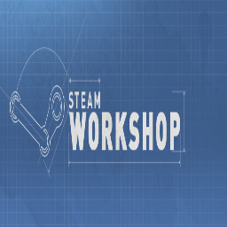

	<h1>Coavins Firearm Repair</h1>
	
	

		Firearm repair overhaul for Project Zomboid
		 ✔ Works in Multiplayer ✔ Tested on 41.73
		 ✔ Compatible with most other firearm mods
	

	

 

Disassemble firearms into parts that can be individually repaired (or replaced) and reassembled. Parts can also be looted from places where you normally find guns, and they can be removed from other guns and re-used. Replaces the default "Repair" action on supported guns.

# How it works

## Repairing a firearm

You won't be able to directly repair firearms anymore. You will instead have to disassemble the gun and either repair or replace the broken parts.

Individual components can be repaired using things like duct tape or metalworking. You should expect firearms to degrade at around the same rate as before, and it should take around the same level of effort to repair a gun the first few times that it breaks.

Alternatively, just replace the broken part with one taken from a different gun.

⚠ It will become increasingly more difficult to repair a firearm as more of its parts are broken.

## Components

This mod adds many new items that are used in repair and reassembly. Spare components can be looted from most places where guns are normally found.

[Check the wiki](https://github.com/coavins/zomboid-coavins-firearms/wiki/Models) for a full list of the different models used to simulate firearm disassembly.

ℹ Some parts can contain other parts, forming a tree structure - all components must be in full working condition before the firearm will operate. If any part is missing or broken, the firearm (if you reassemble it) will be "broken" and will not fire.

ℹ Parts can be swapped between firearms of the same style.

## Condition

This mod completely replaces the existing system that handles condition for firearms.

### Vanilla

A firearm has a chance to lose condition every time you shoot. When this happens, the condition of the gun goes down. The gun can be repaired using another one of the same type of gun.

### With this mod

Firearms retain their original chance to lose condition every time you shoot, but when this happens, we instead check to see if each part inside the gun should lose condition. Different parts lose condition at different rates. The gun itself will display the condition of its most damaged component.

## Compatibility with other mods

This mod should be compatible with most other mods that introduce new firearms or change how they work.

Support has to be added manually for every mod. This is a work in progress.

### Patches provided:
- ✅ Firearms B41
- ✅ VANILLA FIREARMS EXPANSION (B41.65)
- ✅ Arsenal(26) GunFighter
- ✅ Brita's Weapon Pack
- ✅ Totally's Historical Firearms Pack

### Extending this mod
This mod is designed to be extensible so that other mod authors can use it without much effort.

If you are a developer and you want to add support for this feature in your mod, refer to my example mod `coavinssupport1` which shows how to add compatibility with custom firearms. It can take just one line of code to allow your gun to be disassembled.

⚠ By default, only vanilla firearms can be disassembled - if a mod is not explicitly supported, its custom firearms will use the normal repair feature and can not be disassembled.

# Included Mods

These are the mods provided by this Steam workshop item.

### **coavinsfirearms**

This is the main mod, and must be enabled. Supports all of the firearms present in the base game.

### **coavinssupport1**

Compatibility patch for "Firearms B41" (mod id: firearmmod)

Supports most of the custom guns in this mod, except for a small handful (the M60, etc.)

The "Gun Toolkit" items are used to repair components instead of the guns themselves.

### **coavinssupport2**

Compatibility patch for "Arsenal(26) GunFighter" (mod id: Arsenal(26)GunFighter)

Adds support for some of the custom guns in this mod. Should also work for "Brita's Weapons".

### **coavinssupport3**

Compatibility patch for "VANILLA FIREARMS EXPANSION" (mod id: VFExpansion1)

Adds support for most of the custom guns in this mod, only missing a few (SKS, Tec9, W1866, etc.)

The "Gun Cleaning Kit" and "FireKlean" items are used to repair components instead of the guns themselves.

The "FireKlean" item is overridden to increase the number of uses to 4.

### **coavinssupport4**

Compatibility patch for "Totally's Historical Firearms Pack" (mod id: TIHFP)

Adds support for some custom guns in this mod: Makarov, LeeEnfieldMagLoad, Springfield, Thompson, BAR, M1Carbine, G3A3

# Roadmap

Ideas for future development:

* Add support for more guns
* Improve realism by adding more parts and models
* Parts get dirty, affect chance to jam, have to be cleaned
* Add cleaning products like solvents and brushes
* Add alternative parts that can be swapped in to affect firearm stats

# Contribute

✔ Pull requests are encouraged! Please submit your translations, bug fixes, and new features.

🌎 Code is available on Github: https://github.com/coavins/zomboid-coavins-firearms

ℹ You are free to make changes to my code for your own use.

⛔ Please don't reupload this mod to the Steam workshop or any other site, either on its own or as part of a public mod pack. This item is not authorized for posting on Steam, except under the Steam account named Yuki.
