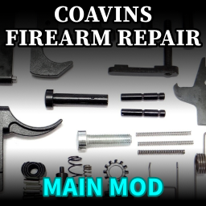

	<h1>Coavins Firearms Disassembly</h1>
	
	

		A Project Zomboid mod that allows firearms to be disassembled into parts.
		 ✔ Works in Multiplayer ✔ Works in 41.73
	

	
	

# How it works

This mod removes the "Repair" context menu for supported firearms, instead allowing them to be disassembled into components that can be individually repaired (or replaced) and reassembled.

These components can be looted from places where you normally find guns, or they can be removed from other guns and re-used.

## Repairing a firearm

You won't be able to directly repair firearms anymore. You will instead have to disassemble the gun and either repair or replace the broken parts.

Individual components can be repaired using things like duct tape or metalworking. You should expect firearms to degrade at around the same rate as before, and it should take around the same level of effort to repair a gun the first few times that it breaks.

⚠ It will take increasingly more effort to repair a firearm as more of its parts are broken.

Alternatively, just replace the broken part with one taken from a different gun.

## Components

This mod adds many new items that are used in repair and reassembly.

**Pistols**: Frame, Slide, Barrel

**Revolvers**: Frame, Cylinder

**Rifles (AR-15 style)**: Lower receiver, Upper receiver, Bolt carrier, Firing pin, Bolt

**Rifles (bolt action)**: Receiver, Bolt

**Shotguns**: Receiver, Forend, Bolt carrier, Bolt, Barrel

Spare components can be looted from most places where guns are normally found.

ℹ Some parts can contain other parts, forming a tree structure - all components must be in full working condition before the firearm will operate. If any part is missing or broken, the firearm (if you reassemble it) will be "broken" and will not fire.

## Condition

This mod completely replaces the existing system that handles condition for firearms.

### Vanilla

A firearm has a chance to lose condition every time you shoot. When this happens, the condition of the gun goes down. The gun can be repaired using another one of the same type of gun.

### With this mod

Firearms retain their original chance to lose condition every time you shoot, but when this happens, we instead check to see if each part inside the gun should lose condition. Different parts lose condition at different rates. The gun itself will display the condition of its most damaged component.

## Compatibility with other mods

This mod should be compatible with most other mods that introduce new firearms or change how they work.

⚠ By default, only vanilla firearms can be disassembled - if you have other mods that add new guns, they will not be affected.

However, this mod is designed to be extensible by other authors so that it can be used with their custom firearms.

- If you are a player and you want to disassemble custom firearms, then either:
  - use one of the included compatibility patches,
  - ask the other author to include support for this mod,
  - or submit a pull request to add a compatibility patch
- If you are a developer and you want to add support for this feature in your mod, refer to my example mod `coavinssupport1` which shows how to add compatibility with custom firearms.

# Included Mods

## coavinsfirearms

This is the base mod, and must be enabled.

## coavinssupport1

Compatibility patch for "Firearms B41". Most of the custom guns in this mod can now be disassembled. The "Gun Toolkit" item is changed to repair parts instead of guns.

# Roadmap

Ideas for future development:

* Parts get dirty, affect chance to jam, have to be cleaned
* Add cleaning products like solvents and brushes
* Add alternative parts that can be swapped in to affect firearm stats

# Contribute

✔ Pull requests are encouraged! Please submit your translations, bug fixes, and new features.

🌎 Code is available on Github: https://github.com/coavins/zomboid-coavins-firearms

ℹ You are free to make changes to my code for your own use.

⛔ Please don't reupload this mod to the Steam workshop, either on its own or as part of a mod pack.
